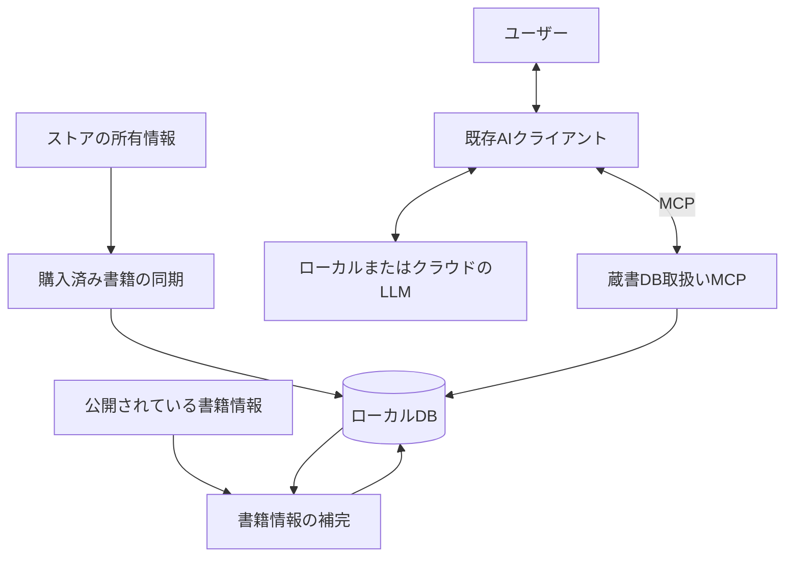

# tsundoku-finder 設計書

更新日: 2026-09-22

本書には決定済みの要件・設計方針を記載する。記載内容は実装完了を意味しない。未決事項を推奨案のまま仕様として扱わない。

- [ツール・サービスの比較評価と調査記録](02product_evaluation.md)
- [設計検討メモ・未決事項](03design_notes.md)

## 1. 目的と利用対象

- プロジェクト名・GitHubリポジトリ名は **tsundoku-finder** とする。
- 複数の電子書籍ストアの所有書籍をローカルDBで管理し、既存AIへの相談に応じて所有している本から推薦を受けられるようにする。
- 主な利用者は本人、利用場所は自分のPC、蔵書規模は数百〜数千冊とする。
- 専用チャット画面は作らず、MCP対応の既存AIクライアントから利用する。CLI型・デスクトップ型のクライアントからの利用を想定する。

## 2. 対象範囲

- 初回実装はAmazon Kindleのみを対象とする。
- 今後の対象ストアはBOOK☆WALKER、DMM、O'Reillyを想定する。対応ストアの処理を追加・差し替えできる構造にする。
- 電子書籍本文の取得・DRM解除・本文の要約は対象にしない。
- 公開されている紹介文・あらすじなどを推薦の材料にする。
- 手動CSV取り込みは初回リリースまでは検討対象にしない。

## 3. システム構成

次の3つの責務に分離し、書籍版の同じローカルDBを利用する。

| 構成要素 | 責務 |
|---|---|
| 購入済み書籍の同期 | ストアから所有書籍を取得し、DBへ保存する |
| 書籍情報の補完 | 公開情報から推薦材料を収集し、DBへ保存する |
| 蔵書DB取扱いMCP | AIクライアントに所有書籍の検索・詳細取得を提供する |

推薦文の生成と対話は既存AIクライアントが担当する。本システムはLLMを直接呼び出さず、MCPを接点とする。LLMがローカルかクラウドかに依存しない構成とする。

## 4. 開発環境

| 項目 | 採用方針 |
|---|---|
| 実装言語 | 3つの構成要素をTypeScriptで統一 |
| 実行環境 | Node.js |
| パッケージ管理 | pnpm |
| Node.jsの導入・バージョン管理 | pnpm経由 |

環境の具体的なバージョンはプロジェクト設定で管理する。代替製品の評価結果だけで採用方針を変更しない。

## 5. データ保護と開発ルール

- 認証情報、ブラウザのセッション、実際の蔵書DB、個人情報を含む取得データをGitへ登録しない。
- テストには架空データまたは個人情報を除去したデータを使う。
- 同期で取得できなかったことだけを理由に既存の所有情報を削除しない。
- 実装・検証・コミットは[AGENTS.md](../AGENTS.md)の作業ルールに従う。

## 6. 将来のゲーム版との関係

- ゲーム版は別システム・別DBとする。書籍版とデータやMCPを統合する前提にしない。
- 「所有情報の同期」「説明情報の補完」「MCPによる検索」という枠組みを再利用する。
- 書籍固有の処理と基盤処理を分離し、将来のコードや設計の再利用を妨げない構造にする。
- 未使用の汎用機構やゲーム向けのデータモデルを先行実装しない。
