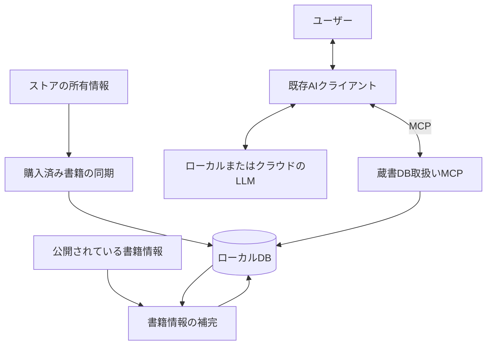

# tsundoku-finder 設計書

更新日: 2026-09-22

本書には決定済みの要件・設計方針を記載する。記載内容は実装完了を意味しない。未決事項を推奨案のまま仕様として扱わない。

- [ツール・サービスの比較評価と調査記録](02product_evaluation.md)
- [設計検討メモ・未決事項](03design_notes.md)

## 1. 目的と利用対象

- プロジェクト名・GitHubリポジトリ名は **tsundoku-finder** とする。
- 複数の電子書籍ストアの所有書籍をローカルDBで管理し、既存AIへの相談に応じて所有している本から推薦を受けられるようにする。
- 主な利用者は本人、利用場所は自分のPC、蔵書規模は数百〜数千冊とする。
- 専用チャット画面は作らず、MCP対応の既存AIクライアントから利用する。CLI型・デスクトップ型のクライアントからの利用を想定する。

## 2. 対象範囲

- 初回実装はAmazon Kindleのみを対象とする。
- 今後の対象ストアはBOOK☆WALKER、DMM、O'Reillyを想定する。対応ストアの処理を追加・差し替えできる構造にする。
- 電子書籍本文の取得・DRM解除・本文の要約は対象にしない。
- 公開されている紹介文・あらすじなどを推薦の材料にする。
- 手動CSV取り込みは初回リリースまでは検討対象にしない。

## 3. システム構成

次の3つの責務に分離し、書籍版の同じローカルDBを利用する。

| 構成要素 | 責務 |
|---|---|
| 購入済み書籍の同期 | ストアから所有書籍を取得し、DBへ保存する |
| 書籍情報の補完 | 公開情報から推薦材料を収集し、DBへ保存する |
| 蔵書DB取扱いMCP | AIクライアントに所有書籍の検索・詳細取得を提供する |

推薦文の生成と対話は既存AIクライアントが担当する。本システムはLLMを直接呼び出さず、MCPを接点とする。LLMがローカルかクラウドかに依存しない構成とする。

## 4. 開発環境

| 項目 | 採用方針 |
|---|---|
| 実装言語 | 3つの構成要素をTypeScriptで統一 |
| 実行環境 | Node.js |
| パッケージ管理 | pnpm |
| Node.jsの導入・バージョン管理 | pnpm経由 |

環境の具体的なバージョンはプロジェクト設定で管理する。代替製品の評価結果だけで採用方針を変更しない。

プロジェクトは単一パッケージ・ES Modules構成とし、TypeScriptのstrict設定で型検査する。Node.jsはpackage.jsonのdevEngines.runtimeでプロジェクト単位に固定し、pnpmが取得する。開発時の実行にはtsx、ビルド・型検査にはTypeScript、テストにはNode.js標準テストランナーを使用する。

CLIはsrc/cli.tsを入口とし、ビルド結果はdist/に出力する。開発・検証手順は[README](../README.md)を参照する。DB・MCPのライブラリは各機能の実装時に選定する。

formatter・linterはBiomeに統一し、標準の整形設定・推奨lintルール・import整理を使う。対象はTypeScript・JavaScript・JSON・JSONCとし、個人データと生成物を除外する。Huskyとlint-stagedによりコミット前にステージ対象へ安全な自動修正を行い、残った警告・エラーはコミットを停止させる。全体検証のpnpm checkでもBiomeを実行する。TypeScript 7.0.2を維持し、型検査は引き続きTypeScriptコンパイラが担当する。

### Kindle取得プロトタイプ

- Amazon.co.jpのKindle for Web本棚を対象に、Playwrightで表示されたDOMから情報を取得する。
- 専用Chromiumプロファイルでユーザーがログイン・追加認証を行い、認証状態を`.local/kindle/browser-profile/`に保持する。
- 現段階では最大50件の少数取得とし、結果は`.local/kindle/samples/`のJSONへ保存する。DBへの同期は行わない。
- 本棚への表示だけでは購入済みとみなさない。所有区分は未確認、全件取得は未完了と明示する。認識できるサンプルは除外する。
- ASIN・書名・著者表示・バッジを抽出し、商品URLはASINから生成した値であることを記録する。

### 購入済み一覧の取得

- 所有判定の取得元としてAmazon.co.jpの「コンテンツと端末の管理 → 本 → 購入済み」を利用する。Playwrightと既存の専用プロファイルを使う。
- `kindle purchases`は先頭ページから最大25件（既定10件）を取得し、`.local/kindle/purchases/`へ保存する。DB同期はまだ行わない。
- 新しいドキュメントで購入済み一覧を開き、URL・選択中のカテゴリーとフィルター・空の検索欄・表示件数と取得行の整合を確認する。不整合や空一覧は現段階では失敗とする。
- ASIN・書名・著者表示・取得日の表示文字列・生成した商品URLを保存する。判定根拠として出典・フィルター・取得日時をレポート内で関連付ける。
- `ownership: purchased`はAmazonの購入済み分類に載った事実を表す。有料購入か無料取得かは判定しない。従来の本棚由来データは未確認のままとし、不在だけを理由に既存情報を削除しない。

### 購入済み一覧の全件取得

- `kindle purchases --all`で25件単位に先頭から順次取得する。ページごとに新しいドキュメントを開き、URL・ページ番号・表示範囲・フィルター・行数を照合する。ページ保存後は3秒待ち、自動再試行は行わない。
- `--max-pages`で1〜1000ページの上限を指定できる（既定1000）。残りがある状態で上限に達した場合は未完了とする。
- 実行ごとに`.local/kindle/collections/<実行ID>/`を作り、各ページの書籍と取得根拠を保存する。保存成功後に`report.json`を一時ファイルから置換して更新する。
- 総件数の不変・連続した範囲・ASINの一意性を検証し、最終範囲と取得件数が総件数に一致した場合のみ完了とする。巡回中に同数の入れ替えが起きる等、固定スナップショットの保証はしない。
- 重複・総件数変化・取得失敗・保存失敗・中断時は取得済みページを保持する。未完了は終了コード1、完了は0。認証情報を含みうる生の例外は出力せず、失敗した処理段階とページ番号を記録する。
- 途中再開は行わず、再実行は別フォルダーで先頭から行う。強制終了や保存障害で`running`が残った場合も未完了として扱う。空一覧は引き続き失敗として扱う。

## 5. データ保護と開発ルール

- 認証情報、ブラウザのセッション、実際の蔵書DB、個人情報を含む取得データをGitへ登録しない。
- テストには架空データまたは個人情報を除去したデータを使う。
- 同期で取得できなかったことだけを理由に既存の所有情報を削除しない。
- 実装・検証・コミットは[AGENTS.md](../AGENTS.md)の作業ルールに従う。

## 6. 将来のゲーム版との関係

- ゲーム版は別システム・別DBとする。書籍版とデータやMCPを統合する前提にしない。
- 「所有情報の同期」「説明情報の補完」「MCPによる検索」という枠組みを再利用する。
- 書籍固有の処理と基盤処理を分離し、将来のコードや設計の再利用を妨げない構造にする。
- 未使用の汎用機構やゲーム向けのデータモデルを先行実装しない。
