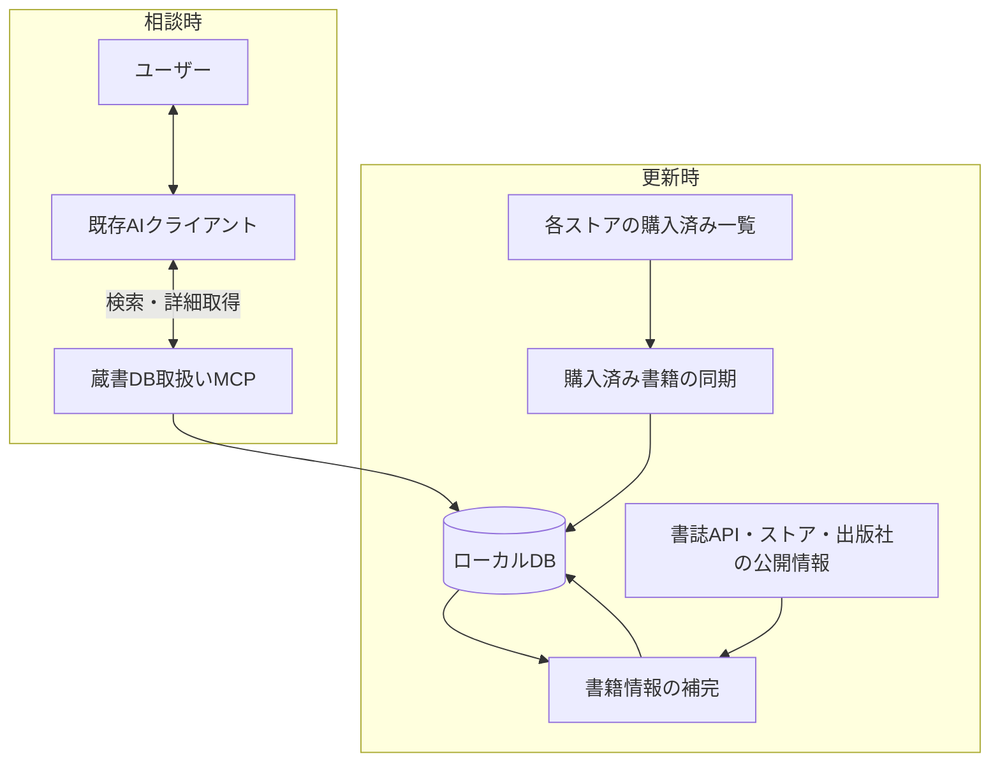

# tsundoku-finder 検討結果

検討日: 2026-09-22

この文書は `00spec_note.md` を起点にした検討の記録である。合意済みの事項と、提案段階の設計・未決事項を区別して記載する。実装済みの仕様を示すものではない。

今後の検討・調査で有用な情報が見つかった場合も、この文書に調査日・出典・設計への影響・未確認事項を追記する。候補の発見と採用の決定は区別し、方針が変わった場合は関連する記述も更新する。

## 1. 目的と合意事項

- プロジェクト名・GitHubリポジトリ名は **`tsundoku-finder`** とする。
- 複数の電子書籍ストアで購入した書籍をローカルDBにまとめ、既存AIに「こういう本が読みたい」と相談すると、所有している本から推薦を受けられるようにする。
- 現在考えている対象ストアは Amazon、BOOK☆WALKER、DMM、O'Reilly。これは作者が多くの電子書籍を所有しているストアだから。
    - 初回実装ではAmazon(Kindle)のみ対応することにする
    - アーキテクチャとして、対応ストアはプラガブルにしたい
- 主な利用者は本人、利用場所は自分のPC、蔵書規模は数百〜数千冊を想定する。
- 専用チャット画面ではなく、既存のMCP対応AIクライアントから利用する。
    - CLIと各社が提供しているデスクトップアプリから利用できると良い
- 電子書籍本文の取得・DRM解除・本文の要約は対象にしない。公開されている紹介文やあらすじなどを推薦に利用する。
- 実装言語は **TypeScript** とする。購入済み書籍の同期、書籍情報の補完、MCPを同じ言語で実装する。
- 将来的には、同等のアーキテクチャでゲーム(Steam, DLsite, DMMなど)にも対応したい。
    - 共通化できるものがあれば共通化する想定で作っておきたい

## 2. アーキテクチャ

責務を次の3つに分け、同じローカルDBを利用する。推薦文の生成とユーザーとの対話は既存AIクライアントが担当する。

| 構成要素 | 責務 | 入出力 |
|---|---|---|
| 購入済み書籍の同期 | 各ストアから所有書籍を取得・更新する | 購入済み一覧 → DBの書籍・所有情報 |
| 書籍情報の補完 | 紹介文・あらすじ・カテゴリ・公開目次などを収集する | DBの書籍情報と書誌API・公開ページ → DBの補足情報・出典 |
| 蔵書DB取扱いMCP | AIに蔵書の検索・詳細取得などを提供する | AIからの検索条件 → 所有書籍と関連情報 |



3つを別アプリや別リポジトリにする必要はない。1つのプロジェクト内で処理を分離し、書籍データの型・DB操作・設定・ログ処理を共有する方針を推奨する。

### 購入済み書籍の同期

- 「自分が何を持っているか」を確定する。公開の商品一覧だけでは所有状況を判断できない。
- ストア別に取得処理を分離し、画面変更や認証方式の違いを局所的に扱えるようにする。
- 商品ID、書名、著者、商品URLなど、取得できる情報を保存する。
- 購入済み一覧APIが利用できない場合は、ログイン済みブラウザを用いたスクレイピングを想定する。
- 今回の調査では、4ストアそれぞれで利用できる購入済み一覧APIは確認できていない。「APIが存在しない」と確定したわけではなく、取得方式は実地検証が必要。

### 書籍情報の補完

- 購入済み一覧だけでは不足する推薦材料を、書誌API・公開の商品ページ・出版社ページなどから補う。
- 書誌APIを優先し、不足分を商品ページ・出版社ページから補完する案を検討する。Webページを取得する場合は購入した商品のページを優先する。情報源間で内容が異なる場合の採用基準は未決定。
- 紹介文などには出典URLと取得日時を保存する。
- 情報補完に失敗しても、書籍の所有情報は保持する。
- 商品IDやISBNなどを照合に利用し、別の巻や改訂版の紹介文を結び付けない。曖昧な照合の確定方法は今後設計する。

### 蔵書DB取扱いMCP

- MCPはAIが蔵書を調べるための接続口であり、それ自体が推薦文を生成するわけではない。
- 初期版は読み取り専用とし、同期・収集は別コマンドで手動実行する案を推奨する。
- AIへの質問のたびに全ストアをスクレイピングせず、保存済みデータを検索する。
- ローカルMCPサーバーをAIクライアントから起動する構成を想定する。利用クライアントと接続設定は未決定。

公開するツールの候補は以下。名前や引数は確定したAPI仕様ではない。

| ツール候補 | 機能 |
|---|---|
| `search_books` | キーワード・著者・カテゴリなどで所有書籍を検索する |
| `get_book` | 書籍の紹介文、出典、所有ストア、商品URLなどを取得する |
| `get_library_summary` | 蔵書数、カテゴリの分布、情報補完の状況などを確認する |

## 3. 技術スタックと選定理由

| 要素 | 現時点の方針 | 状態 |
|---|---|---|
| 実装言語 | TypeScriptに統一 | 合意済み |
| 実行環境 | Node.js | 推奨 |
| ブラウザ操作 | Playwright | 推奨 |
| 保存先 | SQLite | 推奨。DBライブラリ・スキーマは未決定 |
| AIへの接続 | MCP、公式TypeScript SDKを利用 | MCP利用は合意、具体的な依存構成は未決定 |
| 初期検索 | 書名・著者・紹介文などのキーワード検索 | 推奨。日本語の検索方式は要検討 |
| 意味検索 | 必要性を評価して後から追加 | 初期版の必須要件ではない |

### TypeScriptとPythonの比較で確認した点

- 両方ともPlaywright・SQLite・公式MCP SDKを利用でき、今回の機能に決定的な差はない。
- TypeScriptは、ストアごとの取得結果を共通形式に整理し、3つの処理で型を共有する構成に向く。ただし外部データには別途実行時の検証が必要。
- Pythonは情報加工・対話的な分析・機械学習モデルを用いた検索実験に強みがある。
- 現在の要件では収集・情報補完・MCP接続が中心であり、TypeScriptで統一することにした。

## 4. 検索と推薦の考え方

初期版では、既存AIがユーザーの要望を検索語に言い換え、MCPで候補を取得し、紹介文を比較して推薦理由を生成する。必要なら検索語を変えて再検索する。

推薦結果には書名・推薦理由・所有ストアを含める想定とする。紹介文から判断できない内容は断定しない。

### ローカル機械学習モデルは必須ではない

埋め込みモデルは、質問と紹介文を数値ベクトルに変換し、表現が異なっていても意味の近い候補を検索するための追加手段である。本文の取得や要約を目的としない。

たとえば「気持ちが軽くなる本」と「心温まる交流を描いた物語」のように、単語が一致しない場合の検索改善に利用できる。

- 最初から導入する必要はない。実際の質問でキーワード検索の取りこぼしを評価してから判断する。
- 導入する場合も、既存の学習済みモデルを利用し、蔵書で独自モデルを訓練する必要はない。
- ローカル実行と外部APIの選択は導入時に検討する。
- 数百〜数千冊の初期構成では、独立したベクトルDBサーバーを前提にしない。

## 5. データ・運用上の設計候補

以下は推奨案であり、細部は未確定。

| 論点 | 推奨案 |
|---|---|
| 書籍と所有情報 | 書籍情報と、ストアごとの商品ID・所有情報を分ける |
| 重複・版違い | ストアの商品IDを基準に保持し、ストア間の統合は確実なものに限定。巻違い・改訂版は安易に統合しない |
| 所有の範囲 | 無料取得を含む所有書籍を対象とし、読み放題・サンプルは区別する |
| ログイン | 専用ブラウザ環境でユーザーが初回ログイン・追加認証を行い、セッションを再利用する |
| 同期 | 手動で追加・更新する。途中失敗や一時的な非表示を理由に既存の本を自動削除しない |
| 取得失敗 | 所有情報の取得と紹介文の補完の失敗を分け、再実行できるようにする |
| 取得が困難な場合 | 手動CSV取り込みも共通の登録処理につなげられる設計を検討する |
| 認証情報 | セッションなどの認証情報はMCP出力・通常ログ・リポジトリに含めない |
| AIへの情報提供 | DBがローカルでも、MCPが返す書名や紹介文は利用するAIクライアントに渡る |
| 外部テキスト | 収集した紹介文は書籍データとして扱い、AIへの命令として扱わない |

保存する情報の候補は、書名・著者・巻・版、所有ストア・商品ID・商品URL、紹介文・カテゴリ・公開目次、出典・取得日時・同期結果。具体的なテーブルや必須項目は今後設計する。

## 6. セットアップ・配布

主用途は本人のPCでの利用。非プログラマーへの配布も話題になったが、初期版の必須要件にはしていない。

- 手動セットアップではNode.jsにもPythonにも依存環境の準備が必要で、大きな優劣はない。
- 利用者の負担は言語よりも配布方法に左右される。非プログラマー向けには実行環境の同梱やセットアップの自動化が有効。
- 配布を行う場合は、インストール、操作用ブラウザ・DBの準備、ストアへのログイン、MCP登録の案内までを開発範囲として扱う。
- 実行環境を同梱しても、ブラウザなどの依存ファイルの梱包・更新は開発側で対応する必要がある。

## 7. 次に決めること・検証すること

優先して確認する事項:

1. 最初に対応するストアと対象サービス・地域。O'Reillyについても利用しているサービスを特定する。
2. 利用するMCP対応AIクライアントと、ローカルサーバーの接続方法。
3. 推薦品質を確認する代表的な質問例と、期待する候補。

最初のストアでの技術検証:

- 利用条件・アクセス制限を確認し、実際のアカウントで取得方式を検証する。
- 購入済み一覧のページ送りなどを含め、全件を取得できるか。
- 安定した商品IDと、紹介文の補完に使えるURLなどを取得できるか。
- 所有書籍・読み放題・サンプルなどを区別できるか。
- ログイン切れや途中失敗を検出し、再実行できるか。

開発の進め方として、まず **1ストアの取得 → 紹介文の補完 → SQLite保存 → MCP検索 → 既存AIによる推薦** までを通す案を推奨する。その後、他ストアへの拡張と検索品質の改善を進める。

評価用の質問例:

- 「持っている本で、SQLの基礎を学べるもの」
- 「重すぎず、気軽に読めるSF」
- 「この作品に近い雰囲気の小説」

加えて、再同期で重複しないこと、途中失敗で既存データが失われないこと、別巻・別版の情報を誤って結び付けないことを検証する。

## 8. 検討時の参考資料

- [Playwrightの対応言語](https://playwright.dev/docs/languages)
- [Playwrightの認証状態の保存](https://playwright.dev/docs/auth)
- [MCP公式SDK一覧](https://modelcontextprotocol.io/docs/sdk)
- [SQLite FTS5](https://www.sqlite.org/fts5.html) — 日本語検索の方式は別途検討が必要。
- [BOOK☆WALKERの取り扱い書籍一覧](https://help.bookwalker.jp/faq/301) — 公開CSVは商品一覧であり、個人の購入済み一覧ではない。
- [O'Reilly Japan Ebook Storeの購入案内](https://www.oreilly.co.jp/ebook/help.html)
- [Node.jsの実行ファイル化](https://nodejs.org/download/release/latest-jod/docs/api/single-executable-applications.html)

各ライブラリの採用バージョンとストアの具体的な取得方法は、実装時に確認・固定する。

## 9. 追加調査: カーリルAPI・openBD

調査日: 2026-09-22。公式ドキュメントを確認した段階であり、実際の蔵書に対するAPI応答・収録率は未検証。openBDは採用候補とする。

### サービスの違い

| サービス | 確認できた機能 | このプロジェクトでの位置付け |
|---|---|---|
| カーリル図書館API | ISBNと図書館のシステムIDから所蔵・貸出状況を取得。図書館の基本情報も検索可能 | 今回の書誌・紹介文の補完には直接向かない。購入済み一覧の取得を代替するものではない |
| openBD | ISBNを指定して書誌情報を取得。収録内容に応じて書影・内容紹介・目次なども取得可能 | 「書籍情報の補完」の情報源候補。カーリルと版元ドットコムによるプロジェクト |

出典: [カーリル図書館API](https://calil.jp/doc/api.html)、[API仕様書](https://calil.jp/doc/api_ref.html)、[openBD公式](https://openbd.jp/)、[openBDデータ仕様](https://openbd.jp/spec/)。

### アーキテクチャへの反映案

- 購入済み一覧の取得は引き続きストア側で行う。書誌APIから個人の所有状況は分からない。
- 補完処理は複数の情報源を差し替え・追加できる構成にする。ストアの所有情報取得と、書誌情報提供元の処理は別の責務とする。
- ISBNを特定できる書籍はopenBDなどのAPIに問い合わせ、未収録・項目不足の場合は商品ページや出版社ページから補完する案とする。
- openBDは `/get?isbn=ISBN,ISBN` 形式で複数ISBNを指定できる。TypeScriptからHTTPで利用でき、ブラウザ操作を減らせる可能性がある。
- 取得した原文と出典・取得日時を保持し、AIが生成した推薦理由とは区別する。

### 採用前に確認すること

1. **ISBNとの対応付け**: KindleでASINなどのストア固有IDしか得られない場合、対応するISBNを特定する必要がある。ISBNのない商品も想定し、紙版・電子版、巻・改訂版を混同しない。対応付けられない場合も所有情報は保持する。
2. **紹介文の収録率**: 書誌情報が取得できても、推薦に必要な紹介文や目次があるとは限らない。実際の所有書籍で基本書誌と紹介文それぞれの取得率を確認する。
3. **提供データの変更**: 2023年にJPRO由来データの提供構成が変わり、国立国会図書館の書誌情報を基にした代替提供への移行が告知されている。版元ドットコム会員社の情報は継続する一方、収録範囲・項目には変更があり、書影の収録範囲も縮小するとされている。古い紹介記事の網羅率を前提にしない。
4. **利用条件**: 公式ガイドラインは販促・紹介目的での利用、キャッシュへの変更反映、削除要請への対応、取得データの任意改変の禁止を示している。採用時に規約全文と本プロジェクトでの保存・AIへの提供方法を確認する。推薦文は取得原文とは別に扱う。

出典: [2023年7月25日の提供変更告知](https://openbd.jp/news/20230725.html)、[2023年8月29日の代替書誌情報提供開始](https://openbd.jp/news/20230829.html)、[openBD公式ガイドライン・利用規約への案内](https://openbd.jp/)。

## 10. 追加調査: ローカルLLMでの利用

調査日: 2026-09-22。MCPの構成とLM Studioの公式ドキュメントを確認。実際のモデル・クライアントとの接続や推薦品質は未検証。

### 接続の責務

ローカルLLMを使う場合も、現在の3つの構成要素は原則変更不要。tsundoku-finderはLLMを直接呼び出さず、MCPで検索・詳細取得を提供する。

```text
ユーザー ↔ AIアプリ（MCPホスト） ↔ ローカルまたはクラウドのLLM
                    ↕ MCP
           tsundoku-finder ↔ 蔵書DB
```

MCPホスト内のクライアントがMCPサーバーと通信する。AIアプリはモデルにツールの情報を伝え、モデルが求めた呼び出しを実行し、結果をモデルに返す。LLMそのものが直接MCP通信を行う構成ではない。

### 追加実装が必要になる条件

- **MCPとローカルモデルの両方に対応する既存AIアプリを使う場合**: 基本的にtsundoku-finder側の専用実装は不要。モデルの導入、MCPサーバーの登録、対応する通信方式の確認が必要。LM StudioはローカルモデルとMCPサーバーを利用できる候補。
- **モデルの推論APIだけを直接利用する場合**: ツール一覧の受け渡し、モデルのツール呼び出しとMCPの変換、実行結果の返却、対話の継続を担うホスト側の処理が必要。既存の対応アプリを利用すれば、本プロジェクトに実装する必要はない。推論APIのツール呼び出し対応と、MCPホスト機能は別のものとして確認する。
- **将来サーバー内部からLLMや埋め込みAPIを呼ぶ場合**: その機能については推論先や実行環境の設定が必要になる。現時点では採用しない。

### 共通設計と検証事項

- MCPツールの引数・説明を明確にし、結果件数の上限と必要な本の詳細取得を分ける。これにより一度にモデルへ渡す情報量を抑える。クラウド・ローカル共通の設計として扱う。
- モデルとホストの組み合わせで、日本語の検索語生成、正しいツール呼び出し、検索結果に基づく推薦ができるか確認する。MCP接続の成功だけで推薦品質が保証されるわけではない。
- ローカルLLM利用は、取得・同期までオフラインになることを意味しない。ストア同期と公開情報の補完にはネットワークが必要。保存済みデータによる相談は、モデル・ホスト・検索がローカルで完結する構成ならオフラインで利用できる。

出典: [MCPアーキテクチャ](https://modelcontextprotocol.io/specification/2025-11-25/architecture)、[LM StudioのMCPサーバー利用](https://lmstudio.ai/docs/app/mcp)、[LM Studio開発者向け概要](https://lmstudio.ai/docs/developer/)、[Ollamaのツール呼び出しの説明](https://ollama.com/blog/tool-support)。
