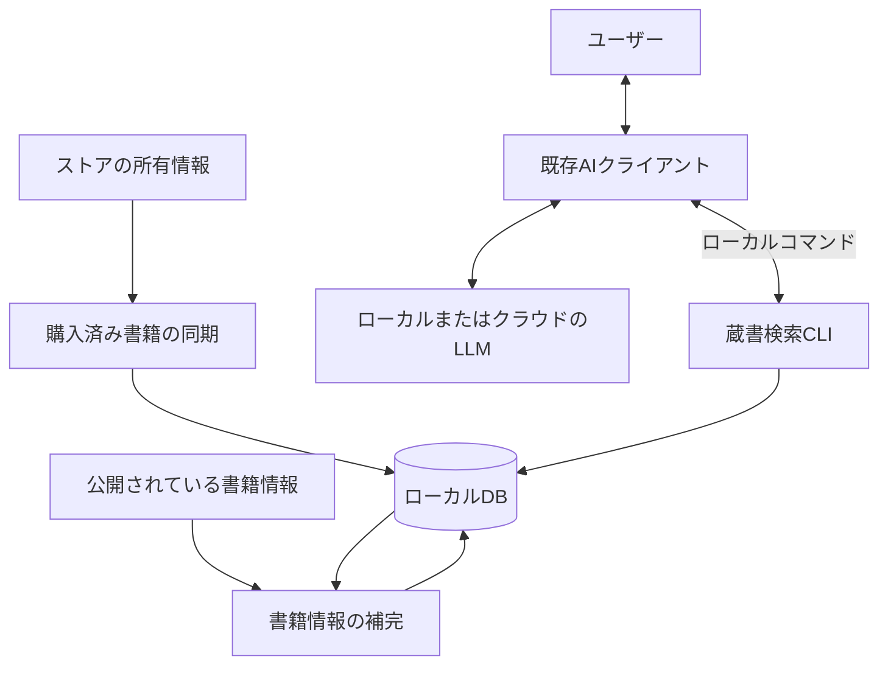

# tsundoku-finder 設計書

更新日: 2026-09-22

本書には決定済みの要件・設計方針を記載する。記載内容は実装完了を意味しない。未決事項を推奨案のまま仕様として扱わない。

- [ツール・サービスの比較評価と調査記録](02product_evaluation.md)
- [設計検討メモ・未決事項](03design_notes.md)

## 1. 目的と利用対象

- プロジェクト名・GitHubリポジトリ名は **tsundoku-finder** とする。
- 複数の電子書籍ストアの所有書籍をローカルDBで管理し、既存AIへの相談に応じて所有している本から推薦を受けられるようにする。
- 主な利用者は本人、利用場所は自分のPC、蔵書規模は数百〜数千冊とする。
- 専用チャット画面は作らず、当面はローカルコマンドを実行できる既存AIからSQLite・検索CLIを利用する。MCPの導入は保留し、必要なクライアントが決まった段階で再検討する。

## 2. 対象範囲

- 初回実装はAmazon Kindleのみを対象とする。
- 今後の対象ストアはBOOK☆WALKER、DMM、O'Reillyを想定する。対応ストアの処理を追加・差し替えできる構造にする。
- 電子書籍本文の取得・DRM解除・本文の要約は対象にしない。
- 公開されている紹介文・あらすじなどを推薦の材料にする。
- 手動CSV取り込みは初回リリースまでは検討対象にしない。

## 3. システム構成

### 実現したい検索例

以下を検索・情報補完の評価対象とする。現時点での対応状況と詳細設計は[検討メモ](03design_notes.md#6-具体的な検索例と必要な情報)に記載する。

- 本の種類による検索（漫画、技術書、推理小説、ライトノベル、アダルト/R18など）。
- 出版社による検索。
- 指定した本と同じ著者の所有書籍。
- 続きを購入済みだが未読の本。
- シリーズで購入したが全く読んでいないもの。
- Blender、3Dモデリング、Pythonに関する本。

読書状態はKindleの既読表示の少数取得まで検証済み。未着手・読書中の判別などの追加調査はTODOとして保留し、当面は書籍情報の補完を優先する。

### 構成要素

次の3つの責務に分離し、書籍版の同じローカルDBを利用する。検索機能はまずCLIで提供する。

| 構成要素 | 責務 |
|---|---|
| 購入済み書籍の同期 | ストアから所有書籍を取得し、DBへ保存する |
| 書籍情報の補完 | 公開情報から推薦材料を収集し、DBへ保存する |
| 蔵書の検索・詳細取得 | SQLiteを読み取り専用で検索し、CLIで提供する。MCPは保留 |

```mermaid
flowchart TD
    A[ストアの所有情報] --> B[購入済み書籍の同期]
    B --> DB[(ローカルDB)]
    C[公開されている書籍情報] --> D[書籍情報の補完]
    DB --> D
    D --> DB
    U[ユーザー] <--> H[既存AIクライアント]
    H <--> L[ローカルまたはクラウドのLLM]
    H <-->|ローカルコマンド| M[蔵書検索CLI]
    M --> DB
```

推薦文の生成と対話は既存AIクライアントが担当する。本システムはLLMを直接呼び出さない。ローカルコマンドやDBを扱えるクライアントで利用し、LLMがローカルかクラウドかには依存しない構成とする。

## 4. 開発環境

| 項目 | 採用方針 |
|---|---|
| 実装言語 | 3つの構成要素をTypeScriptで統一 |
| 実行環境 | Node.js |
| パッケージ管理 | pnpm |
| Node.jsの導入・バージョン管理 | pnpm経由 |

環境の具体的なバージョンはプロジェクト設定で管理する。代替製品の評価結果だけで採用方針を変更しない。

プロジェクトは単一パッケージ・ES Modules構成とし、TypeScriptのstrict設定で型検査する。Node.jsはpackage.jsonのdevEngines.runtimeでプロジェクト単位に固定し、pnpmが取得する。開発時の実行にはtsx、ビルド・型検査にはTypeScript、テストにはNode.js標準テストランナーを使用する。

CLIはsrc/cli.tsを入口とし、ビルド結果はdist/に出力する。開発・検証手順は[README](../README.md)を参照する。DBにはSQLiteとNode.js標準のnode:sqliteを使用する。MCPのライブラリは現段階では導入しない。

formatter・linterはBiomeに統一し、標準の整形設定・推奨lintルール・import整理を使う。対象はTypeScript・JavaScript・JSON・JSONCとし、個人データと生成物を除外する。Huskyとlint-stagedによりコミット前にステージ対象へ安全な自動修正を行い、残った警告・エラーはコミットを停止させる。全体検証のpnpm checkでもBiomeを実行する。TypeScript 7.0.2を維持し、型検査は引き続きTypeScriptコンパイラが担当する。

### Kindle取得プロトタイプ

- Amazon.co.jpのKindle for Web本棚を対象に、Playwrightで表示されたDOMから情報を取得する。
- 専用Chromiumプロファイルでユーザーがログイン・追加認証を行い、認証状態を`.local/kindle/browser-profile/`に保持する。
- 現段階では最大50件の少数取得とし、結果は`.local/kindle/samples/`のJSONへ保存する。DBへの同期は行わない。
- 本棚への表示だけでは購入済みとみなさない。所有区分は未確認、全件取得は未完了と明示する。認識できるサンプルは除外する。
- ASIN・書名・著者表示・バッジを抽出し、商品URLはASINから生成した値であることを記録する。

### 購入済み一覧の取得

- 所有判定の取得元としてAmazon.co.jpの「コンテンツと端末の管理 → 本 → 購入済み」を利用する。Playwrightと既存の専用プロファイルを使う。
- `kindle purchases`は先頭ページから最大25件（既定10件）を取得し、`.local/kindle/purchases/`へ保存する。DB同期はまだ行わない。
- 新しいドキュメントで購入済み一覧を開き、URL・選択中のカテゴリーとフィルター・空の検索欄・表示件数と取得行の整合を確認する。不整合や空一覧は現段階では失敗とする。
- ASIN・書名・著者表示・取得日の表示文字列・生成した商品URLを保存する。判定根拠として出典・フィルター・取得日時をレポート内で関連付ける。
- `ownership: purchased`はAmazonの購入済み分類に載った事実を表す。有料購入か無料取得かは判定しない。従来の本棚由来データは未確認のままとし、不在だけを理由に既存情報を削除しない。

### 購入済み一覧の全件取得

- `kindle purchases --all`で25件単位に先頭から順次取得する。ページごとに新しいドキュメントを開き、URL・ページ番号・表示範囲・フィルター・行数を照合する。ページ保存後は3秒待ち、自動再試行は行わない。
- `--max-pages`で1〜1000ページの上限を指定できる（既定1000）。残りがある状態で上限に達した場合は未完了とする。
- 実行ごとに`.local/kindle/collections/<実行ID>/`を作り、各ページの書籍と取得根拠を保存する。保存成功後に`report.json`を一時ファイルから置換して更新する。
- 総件数の不変・連続した範囲・ASINの一意性を検証し、最終範囲と取得件数が総件数に一致した場合のみ完了とする。巡回中に同数の入れ替えが起きる等、固定スナップショットの保証はしない。
- 重複・総件数変化・取得失敗・保存失敗・中断時は取得済みページを保持する。未完了は終了コード1、完了は0。認証情報を含みうる生の例外は出力せず、失敗した処理段階とページ番号を記録する。
- 途中再開は行わず、再実行は別フォルダーで先頭から行う。強制終了や保存障害で`running`が残った場合も未完了として扱う。空一覧は引き続き失敗として扱う。

### 既読表示の少数検証

- `kindle reading-sample [--limit 1〜25]`（既定10件）で購入済み一覧の先頭ページを検証し、商品ID・出典・取得日時・既読表示を`.local/kindle/reading-samples/`へ保存する。
- 商品ごとの表示領域で、可視の「読んだ本」ラベルが一つある場合のみ`kindleReadState: read`とする。ラベルなし・非表示・重複・未知の文言・領域を特定できない場合は`unknown`。未着手・読書中・未読の判定は行わない。
- 検証結果のscopeは`reading-state-sample`、completeはfalse。既存の購入済みJSONとは分け、DBへ取り込まない。ストア側の既読状態を変更する操作や本文を開く操作は行わない。

### 蔵書DBへの取り込み

- `library import-kindle <取得フォルダー>`で、完了済みの全件取得JSONを`.local/library.sqlite`へ取り込む。ブラウザ・ネットワークは使用しない。現段階では一人・一つのAmazon.co.jpアカウントを前提とする。
- DBを開く前にレポートと全ページのバージョン・完了状態・総件数・連続範囲・ASINの一意性・所有区分・取得根拠・日時を検証する。未完了、空一覧、少数サンプル、参照ファイルの欠損、フォルダー外参照は拒否する。
- `books`はストアと商品IDの複合主キーとし、書名・著者表示・取得日表示・商品URL・所有区分・最初と最後の確認日時を保持する。巻・版やストア間の統合は行わない。
- `imports`は検証したファイル一式のSHA-256を主キーとし、取得期間・取り込み日時・件数を保持する。同じファイル一式は再取り込みしない。
- `ownership_evidence`は取り込み・ストア・商品IDごとに、ページ番号・出典・取得日時・購入済みフィルターを保持する。最新値の更新は取得日時が新しい場合のみ行い、古い履歴の取り込みも根拠として保持する。一覧に存在しないことを理由に削除しない。
- スキーマ作成・書籍更新・履歴・根拠の保存を単一トランザクションで確定する。失敗時はロールバックする。外部キーを有効にし、DB識別子とスキーマバージョンを検査して未知のDBを拒否する。新規DBファイル自体は失敗時にも残る場合がある。
- `library summary`で件数を読み取り専用で確認する。情報補完は後続で実装する。

### 蔵書の検索・詳細取得

- `library search "検索語" [--limit 1〜100] [--offset 0〜100000]`で書名・著者表示を部分一致検索する。空白区切りはAND条件、空文字列は全件を対象とする。ASCII英字の大小は区別しないが、全半角や表記揺れの正規化は行わない。
- 件数の既定は20件。ストア・商品IDの順で安定して並べ、総件数・次のoffsetとともにJSONを返す。検索文字列は最大200文字で、SQLパラメーターとして渡す。`%`や`_`をワイルドカードとして解釈しない。
- `library get <ASIN>`でKindleの書籍詳細と最新の所有確認根拠をJSONで返す。未登録の場合は`book: null`とする。紹介文やあらすじはまだ扱わない。
- CLIから独立した検索モジュールを設ける。接続は読み取り専用とし、DBがない場合は新規作成せず失敗する。
- MCPは必要性を再検討した結果、導入を保留する。まずSQLite＋CLIで実際の検索を試し、接続先の要件が明らかになってから追加を判断する。

### 書誌情報の少数取得プロトタイプ

- `metadata kindle <所有ASIN>`で蔵書DBに存在するKindle商品1冊を取得する。ログイン状態を引き継がない一時Chromiumを使い、商品ページを開いて処理後に閉じる。購入・本文閲覧・状態変更は行わない。
- URLと登録情報のASIN、書名、著者欄のKindle版表示を照合する。確認できないページは保存せず失敗する。自動再試行・一括取得は行わない。
- 対象商品欄に限定し、書名・著者表示・出版社・発売日表示・紹介文・ストア分類・シリーズ表示とURLを出典・取得日時付きで`.local/metadata/kindle/`へ保存する。空白・方向制御文字を整理するが、紹介文の生成・要約や独自分類への変換は行わない。
- scopeは`kindle-metadata-sample`。未取得はnullまたは空配列とし、推測で埋めない。シリーズURLの追跡、ISBN照合、DB保存・検索への反映はまだ行わない。

## 5. データ保護と開発ルール

- 認証情報、ブラウザのセッション、実際の蔵書DB、個人情報を含む取得データをGitへ登録しない。
- テストには架空データまたは個人情報を除去したデータを使う。
- 同期で取得できなかったことだけを理由に既存の所有情報を削除しない。
- 実装・検証・コミットは[AGENTS.md](../AGENTS.md)の作業ルールに従う。

## 6. 将来のゲーム版との関係

- ゲーム版は別システム・別DBとする。書籍版とデータやMCPを統合する前提にしない。
- 「所有情報の同期」「説明情報の補完」「MCPによる検索」という枠組みを再利用する。
- 書籍固有の処理と基盤処理を分離し、将来のコードや設計の再利用を妨げない構造にする。
- 未使用の汎用機構やゲーム向けのデータモデルを先行実装しない。
