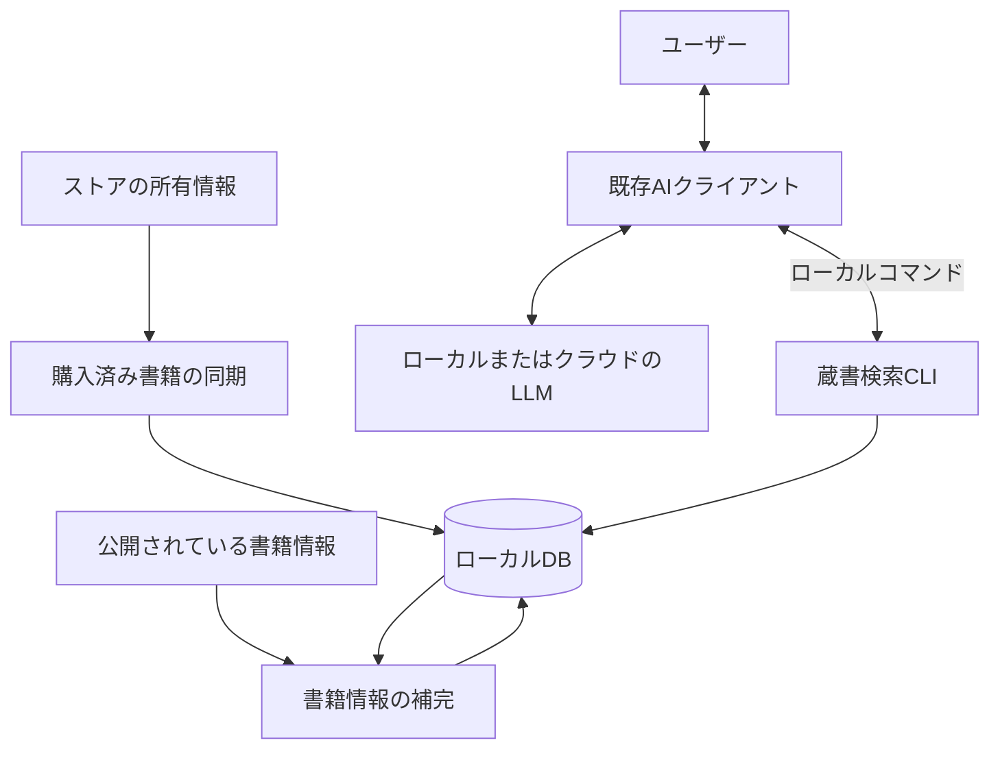

# tsundoku-finder 設計書

更新日: 2026-09-22

本書には決定済みの要件・設計方針を記載する。記載内容は実装完了を意味しない。未決事項を推奨案のまま仕様として扱わない。

- [ツール・サービスの比較評価と調査記録](02product_evaluation.md)
- [設計検討メモ・未決事項](03design_notes.md)

## 1. 目的と利用対象

- プロジェクト名・GitHubリポジトリ名は **tsundoku-finder** とする。
- 複数の電子書籍ストアの所有書籍をローカルDBで管理し、既存AIへの相談に応じて所有している本から推薦を受けられるようにする。
- 主な利用者は本人、利用場所は自分のPC、蔵書規模は数百〜数千冊とする。
- 専用チャット画面は作らず、当面はローカルコマンドを実行できる既存AIからSQLite・検索CLIを利用する。MCPの導入は保留し、必要なクライアントが決まった段階で再検討する。

## 2. 対象範囲

- 初回実装はAmazon Kindleのみを対象とする。
- Kindleに続く第2の対象ストアはBOOK☆WALKERとする。既存データを維持し、少数サンプルによる取得項目・所有根拠の確認から着手する。
- 今後の対象ストアはBOOK☆WALKER、DMM、O'Reillyを想定する。対応ストアの処理を追加・差し替えできる構造にする。
- 電子書籍本文の取得・DRM解除・本文の要約は対象にしない。
- 公開されている紹介文・あらすじなどを推薦の材料にする。
- 手動CSV取り込みは初回リリースまでは検討対象にしない。
- プロトタイピング中は旧スキーマ・保存形式・CLIとの互換性を必須要件にしない。必要な変更は最新版に揃えて行う。保存済みデータの再利用と、取得し直しを最小限にする方針は維持する。

## 3. システム構成

### 実現したい検索例

以下を検索・情報補完の評価対象とする。現時点での対応状況と詳細設計は[検討メモ](03design_notes.md#6-具体的な検索例と必要な情報)に記載する。

- 本の種類による検索（漫画、技術書、推理小説、ライトノベル、アダルト/R18など）。
- 出版社による検索。
- 指定した本と同じ著者の所有書籍。
- 続きを購入済みだが未読の本。
- シリーズで購入したが全く読んでいないもの。
- Blender、3Dモデリング、Pythonに関する本。

読書状態はKindleの既読表示の少数取得まで検証済み。未着手・読書中の判別などの追加調査はTODOとして保留し、当面は書籍情報の補完を優先する。

### 構成要素

次の3つの責務に分離し、書籍版の同じローカルDBを利用する。検索機能はまずCLIで提供する。

| 構成要素 | 責務 |
|---|---|
| 購入済み書籍の同期 | ストアから所有書籍を取得し、DBへ保存する |
| 書籍情報の補完 | 公開情報から推薦材料を収集し、DBへ保存する |
| 蔵書の検索・詳細取得 | SQLiteを読み取り専用で検索し、CLIで提供する。MCPは保留 |

```mermaid
flowchart TD
    A[ストアの所有情報] --> B[購入済み書籍の同期]
    B --> DB[(ローカルDB)]
    C[公開されている書籍情報] --> D[書籍情報の補完]
    DB --> D
    D --> DB
    U[ユーザー] <--> H[既存AIクライアント]
    H <--> L[ローカルまたはクラウドのLLM]
    H <-->|ローカルコマンド| M[蔵書検索CLI]
    M --> DB
```

推薦文の生成と対話は既存AIクライアントが担当する。本システムはLLMを直接呼び出さない。ローカルコマンドやDBを扱えるクライアントで利用し、LLMがローカルかクラウドかには依存しない構成とする。

## 4. 開発環境

| 項目 | 採用方針 |
|---|---|
| 実装言語 | 3つの構成要素をTypeScriptで統一 |
| 実行環境 | Node.js |
| パッケージ管理 | pnpm |
| Node.jsの導入・バージョン管理 | pnpm経由 |

環境の具体的なバージョンはプロジェクト設定で管理する。代替製品の評価結果だけで採用方針を変更しない。

プロジェクトは単一パッケージ・ES Modules構成とし、TypeScriptのstrict設定で型検査する。Node.jsはpackage.jsonのdevEngines.runtimeでプロジェクト単位に固定し、pnpmが取得する。開発時の実行にはtsx、ビルド・型検査にはTypeScript、テストにはNode.js標準テストランナーを使用する。

CLIはsrc/cli.tsを入口とし、ビルド結果はdist/に出力する。開発・検証手順は[README](../README.md)を参照する。DBにはSQLiteとNode.js標準のnode:sqliteを使用する。MCPのライブラリは現段階では導入しない。

formatter・linterはBiomeに統一し、標準の整形設定・推奨lintルール・import整理を使う。対象はTypeScript・JavaScript・JSON・JSONCとし、個人データと生成物を除外する。Huskyとlint-stagedによりコミット前にステージ対象へ安全な自動修正を行い、残った警告・エラーはコミットを停止させる。全体検証のpnpm checkでもBiomeを実行する。TypeScript 7.0.2を維持し、型検査は引き続きTypeScriptコンパイラが担当する。

### Kindle取得プロトタイプ

- Amazon.co.jpのKindle for Web本棚を対象に、Playwrightで表示されたDOMから情報を取得する。
- 専用Chromiumプロファイルでユーザーがログイン・追加認証を行い、認証状態を`.local/kindle/browser-profile/`に保持する。
- 現段階では最大50件の少数取得とし、結果は`.local/kindle/samples/`のJSONへ保存する。DBへの同期は行わない。
- 本棚への表示だけでは購入済みとみなさない。所有区分は未確認、全件取得は未完了と明示する。認識できるサンプルは除外する。
- ASIN・書名・著者表示・バッジを抽出し、商品URLはASINから生成した値であることを記録する。

### 購入済み一覧の取得

- 所有判定の取得元としてAmazon.co.jpの「コンテンツと端末の管理 → 本 → 購入済み」を利用する。Playwrightと既存の専用プロファイルを使う。
- `kindle purchases`は先頭ページから最大25件（既定10件）を取得し、`.local/kindle/purchases/`へ保存する。DB同期はまだ行わない。
- 新しいドキュメントで購入済み一覧を開き、URL・選択中のカテゴリーとフィルター・空の検索欄・表示件数と取得行の整合を確認する。不整合や空一覧は現段階では失敗とする。
- ASIN・書名・著者表示・取得日の表示文字列・生成した商品URLを保存する。判定根拠として出典・フィルター・取得日時をレポート内で関連付ける。
- `ownership: purchased`はAmazonの購入済み分類に載った事実を表す。有料購入か無料取得かは判定しない。従来の本棚由来データは未確認のままとし、不在だけを理由に既存情報を削除しない。

### 購入済み一覧の全件取得

- `kindle purchases --all`で25件単位に先頭から順次取得する。ページごとに新しいドキュメントを開き、URL・ページ番号・表示範囲・フィルター・行数を照合する。ページ保存後は3秒待ち、自動再試行は行わない。
- `--max-pages`で1〜1000ページの上限を指定できる（既定1000）。残りがある状態で上限に達した場合は未完了とする。
- 実行ごとに`.local/kindle/collections/<実行ID>/`を作り、各ページの書籍と取得根拠を保存する。保存成功後に`report.json`を一時ファイルから置換して更新する。
- 総件数の不変・連続した範囲・ASINの一意性を検証し、最終範囲と取得件数が総件数に一致した場合のみ完了とする。巡回中に同数の入れ替えが起きる等、固定スナップショットの保証はしない。
- 重複・総件数変化・取得失敗・保存失敗・中断時は取得済みページを保持する。未完了は終了コード1、完了は0。認証情報を含みうる生の例外は出力せず、失敗した処理段階とページ番号を記録する。
- 途中再開は行わず、再実行は別フォルダーで先頭から行う。強制終了や保存障害で`running`が残った場合も未完了として扱う。空一覧は引き続き失敗として扱う。

### 既読表示の少数検証

- `kindle reading-sample [--limit 1〜25]`（既定10件）で購入済み一覧の先頭ページを検証し、商品ID・出典・取得日時・既読表示を`.local/kindle/reading-samples/`へ保存する。
- 商品ごとの表示領域で、可視の「読んだ本」ラベルが一つある場合のみ`kindleReadState: read`とする。ラベルなし・非表示・重複・未知の文言・領域を特定できない場合は`unknown`。未着手・読書中・未読の判定は行わない。
- 検証結果のscopeは`reading-state-sample`、completeはfalse。既存の購入済みJSONとは分け、DBへ取り込まない。ストア側の既読状態を変更する操作や本文を開く操作は行わない。

### 蔵書DBへの取り込み

- `library import-kindle <取得フォルダー>`で、完了済みの全件取得JSONを`.local/library.sqlite`へ取り込む。ブラウザ・ネットワークは使用しない。現段階では一人・一つのAmazon.co.jpアカウントを前提とする。
- DBを開く前にレポートと全ページのバージョン・完了状態・総件数・連続範囲・ASINの一意性・所有区分・取得根拠・日時を検証する。未完了、空一覧、少数サンプル、参照ファイルの欠損、フォルダー外参照は拒否する。
- `books`はストアと商品IDの複合主キーとし、書名・著者表示・取得日表示・商品URL・所有区分・最初と最後の確認日時を保持する。巻・版やストア間の統合は行わない。
- `imports`は検証したファイル一式のSHA-256を主キーとし、取得期間・取り込み日時・件数を保持する。同じファイル一式は再取り込みしない。
- `ownership_evidence`は取り込み・ストア・商品IDごとに、ページ番号・出典・取得日時・購入済みフィルターを保持する。最新値の更新は取得日時が新しい場合のみ行い、古い履歴の取り込みも根拠として保持する。一覧に存在しないことを理由に削除しない。
- スキーマ作成・書籍更新・履歴・根拠の保存を単一トランザクションで確定する。失敗時はロールバックする。外部キーを有効にし、DB識別子とスキーマバージョンを検査して未知のDBを拒否する。新規DBファイル自体は失敗時にも残る場合がある。
- `library summary`で所有情報の件数を読み取り専用で確認する。

### BOOK☆WALKERの少数取得・取り込み

- `bookwalker purchases [--limit 1〜25]`（既定10件）で購入済み一覧の先頭ページから少数取得する。専用Chromiumでログインを最大5分待ち、認証状態を`.local/bookwalker/browser-profile/`に保存する。通常のChromeやKindleのプロファイルとは別とする。
- 個々の巻が表示される一覧を対象とし、1ページ50件の表示範囲とDOM行数を検証する。ページ送り・CSV取得・書誌詳細の展開・本文閲覧・読書状態の変更は行わない。
- UUID、商品URL、書名、著者欄の表示、購入日時を`.local/bookwalker/purchases/`に保存する。著者欄に省略や補助文言が混ざることを許容する。空一覧・集約表示・URLや件数の不整合・必要な画面要素の欠落は失敗とする。
- 見出し・表示範囲・行数・検索語・カテゴリ／レーベル／出版社／読書状態／R18の選択表示・非集約表示の根拠を同じDOM読み取りで取得する。検索・絞り込みがある一覧も、条件を記録した部分取得として扱う。条件を自動変更しない。
- `library import-bookwalker <JSON>`でオフライン取り込みする。専用scope・日時・所有根拠・上限・件数・UUID・URL・重複をDBオープン前に再検証する。調査用の旧JSONは受け付けない。同じ検証済み文書は整形差によらず再取り込みしない。
- scopeはbookwalker-purchased-first-page-sample、completeは常にfalse。DBのcoverageはpartial/bookwalker-holdbooksとし、画面情報はownership_evidence.details.displayに保持する。取得コマンド自体はDBへ書き込まない。新CLIの実サイトでの実行確認は未完了で、模擬DOMと隔離DBで検証済み。

### 蔵書の検索・詳細取得

- `library search "検索語" [--publisher "出版社"] [--limit 1〜100] [--offset 0〜100000]`で書名・著者表示と最新の補完情報（書名・著者表示・出版社・紹介文・分類・シリーズ表示・レーベル・ジャンル）を部分一致検索する。空白区切りはAND条件、空文字列は全件を対象とする。出版社指定は補完情報の出版社への部分一致による追加条件とする。ASCII英字の大小は区別しないが、全半角や表記揺れの正規化は行わない。
- 件数の既定は20件。ストア・商品IDの順で安定して並べ、総件数・次のoffsetとともにJSONを返す。検索文字列は最大200文字で、SQLパラメーターとして渡す。`%`や`_`をワイルドカードとして解釈しない。
- `library get <商品ID> [--store kindle-jp|bookwalker-jp]`で書籍詳細・最新の所有確認根拠・最新の補完情報をJSONで返す。ストア既定値はkindle-jp。KindleはASIN、BOOK☆WALKERはde接頭辞なしの小文字UUIDを指定する。未登録の場合は`book: null`、補完情報がない場合は`metadata: null`とする。
- CLIから独立した検索モジュールを設ける。接続は読み取り専用とし、DBがない場合は新規作成せず失敗する。
- AND・ORを組み合わせる検索CLIの拡張はTODOとして後回しにし、DB整備を優先する。現行の検索機能は維持する。
- MCPは必要性を再検討した結果、導入を保留する。まずSQLite＋CLIで実際の検索を試し、接続先の要件が明らかになってから追加を判断する。

### 書誌情報の少数取得プロトタイプ

書誌データは検索・推薦の手助けとなる情報を集めるために保持する。厳密な書誌DBの構築や継続的な手動メンテナンスは当面の目的としない。

- 著者・出版社は表示文字列、分類はストアのラベル、紹介文は取得した説明、シリーズは表示文字列とURLを基本に保存する。著者欄の形式表示など、検索の妨げにならない余分な文言を許容する。
- 現行の保存項目を基本とし、独自分類・著者の人物同一性・厳密な巻順の構造化や手動補正機能を先行実装しない。派生値・補正用テーブルの追加も当面不要とする。
- 全半角・同義語などは、当面クエリー側のAND・OR条件で補う。例えば「シリーズ名 AND (1巻 OR １巻)」に相当する検索を目指す。具体的なCLI指定は検討中であり、現行CLIが式を解釈することを意味しない。
- 検索は候補抽出として扱い、部分一致を巻の同定やジャンルの確定とみなさない。例えば「1巻」は「11巻」にも一致し得る。必要に応じ検索語を具体化し、詳細を確認する。
- 商品IDの照合、所有の根拠、出典・取得日時の保持、欠損を推測で埋めない方針は維持する。実際の検索で不足した項目だけ追加取得を検討する。

- `metadata kindle <所有ASIN>`で蔵書DBに存在するKindle商品1冊を取得する。ログイン状態を引き継がない一時Chromiumを使い、商品ページを開いて処理後に閉じる。購入・本文閲覧・状態変更は行わない。
- URLと登録情報のASIN、書名、著者欄のKindle版表示を照合する。確認できないページは保存せず失敗する。自動再試行・一括取得は行わない。
- 対象商品欄に限定し、書名・著者表示・出版社・発売日表示・紹介文・ストア分類・シリーズ表示とURLを出典・取得日時付きで`.local/metadata/kindle/`へ保存する。空白・方向制御文字を整理するが、紹介文の生成・要約や独自分類への変換は行わない。
- scopeは`kindle-metadata-sample`。未取得はnullまたは空配列とし、推測で埋めない。シリーズURLの追跡、ISBN照合は行わない。
- 検証では購入済み一覧1ページ分（25冊）を基本の固定サンプルとし、保存済みJSONを再利用する。追加項目の検証ごとに購入済み一覧や商品情報を全件再取得しない。不足時だけ必要な少数を追加取得し、全蔵書への展開は後で判断する。

### BOOK☆WALKERの書誌補完

- `metadata bookwalker <所有UUID>`で所有DBに登録済みの商品1冊を取得する。書誌JSONを`.local/metadata/bookwalker/`へ保存し、`metadata import <JSON>`で共通の履歴保存処理へ取り込む。取得コマンド自体はDBを更新しない。
- 書名、役割を含む著者表示、出版社、紹介文、カテゴリ、シリーズ名・URL、レーベル、ジャンル、配信開始日を取得する。publicationDateTextは不明としてnullとし、配信開始日を発売日へ転用しない。
- 商品URL、単一の商品見出し、その書名とURLが一致するページ内リンクを照合する。作品情報のdt/ddと対象商品の紹介文領域に限定し、関連商品・広告を取り込まない。同じ項目の重複は曖昧な構造として拒否する。必要に応じ「あらすじを読む」を展開するが、本文・試し読み・購入の操作は行わない。
- ログイン情報を引き継がない一時ブラウザを使う。認証・年齢確認等で対象商品を確認できない場合は失敗とし、自動再試行や全件取得を行わない。今回の実DOM検証はログイン済みChromeの既存サンプル1冊を保存して再生したもので、未ログインでの新CLI一連の実行は未確認。

### 書誌アダプターの接続

- `stores/registry.ts`で静的に登録するStoreAdapterに、ストアID、CLI名、商品ID判定、商品URL生成、シリーズURL判定、書誌形式固有の検証、ページ準備・抽出を持たせる。現時点ではKindleとBOOK☆WALKERを登録する。未知ストアと重複登録を拒否し、外部プラグインの動的ロードは行わない。
- 型・日時・共通項目・欠損表示の検証、所有確認、ファイル保存、DB履歴保存、検索は共通処理とする。Playwrightの実行処理は必要時に読み込み、オフラインの書誌取り込みではブラウザを起動しない。商品IDの詳細取得時検証も同じ登録表を参照する。
- 書誌の既存共通項目に適合するストアはアダプターと登録の追加で接続する。新しい検索項目には共通JSON検証と検索SQLの拡張が必要。所有情報のscope・取得根拠・完了判定はまだ既存2ストアの分岐が残っており、すべての機能を追加だけで拡張できるわけではない。

### 保存済み書誌情報の取り込み

- `metadata import <JSONファイル>`で1冊分の保存済み書誌JSONを既存の蔵書DBへ取り込む。ネットワーク・ブラウザは使わない。形式・商品ID・出典・取得日時・欠損表示を検証し、未所有の商品は拒否する。
- `metadata_snapshots`に出典・取得日時を含む文書全体を保存し、所有情報を上書きしない。検証後の文書のSHA-256で同一内容の再取り込みを抑止する。同じ商品・取得日時で内容が異なる場合は競合として拒否する。
- `latest_metadata`は商品ごとに取得日時が最新の文書を選ぶ。過去の文書は保持するが、最新文書の欠損を古い値で埋めず、検索と詳細取得には最新文書を使う。
- 現在のDB更新処理はv1/v2をv3へ更新し、保存と同一トランザクションで行う。失敗時は更新も取り消す。読み取り時には更新しない。旧版への長期互換は保証しない。
- `metadata summary`は全所有冊数（total）、書誌情報を取り込み済みの冊数（captured）、未取り込み冊数（pending）、保存した履歴数（snapshots）を返す。capturedは全項目の補完完了を意味せず、欠損は各文書のmissingFieldsで確認する。

## 5. DBの保存項目とテーブル構成

保存項目とテーブル構成は以下のスキーマv3とする。所有情報の保存をストア別の検証・変換から分離する。今回の実装検証は架空データの隔離DBで行い、実蔵書DBの更新は行っていない。

### 所有情報の共通保存

- ストア別に検証した入力をOwnershipImportへ変換し、共通の保存処理へ渡す。Kindleのファイル検証と変換はKindle側に置く。商品ID・商品URL・所有根拠・取得日時・重複は共通保存前にも検証する。
- booksの複合主キーと基本カラムは維持する。ownershipは購入済み一覧に載った意味でのpurchasedであり、有料取得かどうかは確定しない。
- imports.coverageはstatusとscopeを持つJSON。現時点でKindleはcomplete/kindle-purchased-list、BOOK☆WALKERはpartial/bookwalker-holdbooksを受け付ける。completeは対象範囲の取得完了であり、すべての利用権を取得した意味ではない。
- BOOK☆WALKERは先頭ページの少数取得・保存ファイル検証・部分取り込みまで実装する。書誌補完は所有商品1冊ずつ対応し、全件巡回は未実装。調査用サンプルをそのまま正式入力として扱わない。
- 所有根拠のcategory/filterはKindleでは本/購入済み、BOOK☆WALKERではnull。kindで取得元を区別する。details.observedBookに観測時の書名・著者・購入日表示・商品URLを保持し、同じ観測日時の異なる値は拒否する。BOOK☆WALKERの画面条件はdetails.displayに保持する。
- 古い所有根拠には当時の書名等がないため、同時刻の別入力を現在値とも照合できない場合は拒否する。同一取り込みIDの再実行は変更なしとする。不在の書籍は削除しない。

### DBのテーブル構成

| テーブル | キー・関連 | 保存する内容 |
|---|---|---|
| books | 主キー(store, product_id)。latest_import_idはimportsを参照 | 所有する商品の基本情報 |
| imports | 主キーid（取得ファイル一式のSHA-256） | 購入済み一覧の取り込み履歴 |
| ownership_evidence | 主キー(import_id, store, product_id)。importsとbooksを参照 | 商品ごとの所有確認根拠 |
| metadata_snapshots | 主キーid（検証後の書誌文書のSHA-256）。(store, product_id, captured_at)は一意。booksを参照 | 公開商品情報の取得履歴と取得値のJSON |

`latest_metadata`は、商品ごとに取得日時が最新のmetadata_snapshotsを選ぶビューとする。別の実体テーブルに最新値を複製しない。4テーブルはSTRICTとし、書き込み接続で外部キーを有効にする。

### 通常のカラムとして保持する項目

| テーブル | カラム（キーを含む） |
|---|---|
| books | store, product_id, title, authors_text, acquired_date_text, product_url, ownership, first_seen_at, last_seen_at, latest_import_id |
| imports | id, source_store, started_at, completed_at, imported_at, book_count, coverage |
| ownership_evidence | import_id, store, product_id, page_number, source, captured_at, category, filter, kind, details |
| metadata_snapshots | id, store, product_id, captured_at, document |

book_count・page_numberはINTEGER、その他はTEXT。category/filterと旧履歴のcoverageのみNULLを許可し、それ以外はNOT NULL。ownershipはpurchasedのみ。document・detailsと非NULLのcoverageにjson_valid制約を設ける。取得日時はUTCのISO 8601文字列とし、商品画面に表示された購入日・発売日の文字列とは区別する。

現行のv1/v2更新処理は既存行・取り込みID・書誌JSONを保持し、旧imports.coverageはNULL、旧ownership_evidence.detailsは空オブジェクトとする。更新・取り込みを同じトランザクションで行う。旧版読取処理は現状残っているが、将来の互換性を要件とはしない。

### 書誌JSON内に保持する項目

出版社・紹介文等はmetadata_snapshots.document内に保持する。当面は専用カラム・著者マスター・分類マスター・シリーズテーブルへ展開しない。SQLiteからはJSON関数で参照でき、検索のためだけに保存値を重複させない。

| JSON項目 | 型・欠損 | 意味 |
|---|---|---|
| schemaVersion, scope | 数値1、ストア別scope（kindle-metadata-sample / bookwalker-metadata-sample） | 保存形式の識別。DBスキーマのバージョンとは別 |
| store, productId | 文字列・必須 | 対象のストア商品。テーブル側と同じ値で保存 |
| source, capturedAt | 文字列・必須 | 対象商品URL、取得日時 |
| title, authorsText | 文字列・必須 | 商品ページの書名・著者欄。形式表示や役割などの混在を許容 |
| publisher | 文字列またはnull | 出版社表示。レーベルや法人名の同一性は整理しない |
| publicationDateText | 文字列またはnull | 発売日の表示文字列 |
| description | 文字列またはnull | 紹介文。本文の取得・要約はしない |
| categories | 文字列配列、欠損は空配列 | ストア分類の表示順を保持。独自分類へ置換しない |
| series | {text, url}またはnull | シリーズ表示とストア内URL。巻数・読む順序は別途数値化しない |
| label | 文字列またはnull（未定義も可） | レーベル。BOOK☆WALKERで取得し、語句検索の対象とする |
| genres | 文字列配列（未定義も可） | ストアのジャンル表示。categoriesと分け、語句検索の対象とする |
| distributionDateText | 文字列またはnull（未定義も可） | 配信開始日の表示。紙書籍の発売日とは区別する |
| missingFields | 文字列配列 | publisher・description・categories・seriesの欠損一覧。全項目の充足や欠損原因を表すものではない |

「取得値」は既存抽出処理で空白・方向制御文字を整理した値を指し、生HTMLの保存ではない。documentは取り込み検証後の項目で構成するため、未定義の追加項目を自動保存する形式ではない。項目を追加するときは抽出・JSON検証・読み取り側の対応を合わせて行う。

### 採用値と更新のルール

- 所有一覧の書名・著者等はbooks、商品ページの書名・著者等はdocumentにそれぞれ残す。補完でbooksを書き換えず、現行の検索は両方を対象とする。
- 書誌の検索対象は最新の文書一式。過去の履歴を残し、欠損を過去の値から自動で補充しない。欠損は不明であり、非該当・全年齢・シリーズなし等とみなさない。
- 同一文書の取り込みは変更なし。同じ商品・取得日時で異なる文書は拒否し、時刻が古い文書は履歴としてのみ追加する。
- 商品ページの取得失敗では新しい文書を作らず、保存済みの所有情報・書誌履歴を保持する。
- 手動補正、人物統合、独自分類、巻順の正規化、読書状態、ISBN対応、検索用ベクトルのテーブルは当面追加しない。具体的な必要性を確認してから拡張する。

## 6. データ保護と開発ルール

- 認証情報、ブラウザのセッション、実際の蔵書DB、個人情報を含む取得データをGitへ登録しない。
- テストには架空データまたは個人情報を除去したデータを使う。
- 同期で取得できなかったことだけを理由に既存の所有情報を削除しない。
- 実装・検証・コミットは[AGENTS.md](../AGENTS.md)の作業ルールに従う。

## 7. 将来のゲーム版との関係

- ゲーム版は別システム・別DBとする。書籍版とデータやMCPを統合する前提にしない。
- 「所有情報の同期」「説明情報の補完」「MCPによる検索」という枠組みを再利用する。
- 書籍固有の処理と基盤処理を分離し、将来のコードや設計の再利用を妨げない構造にする。
- 未使用の汎用機構やゲーム向けのデータモデルを先行実装しない。
