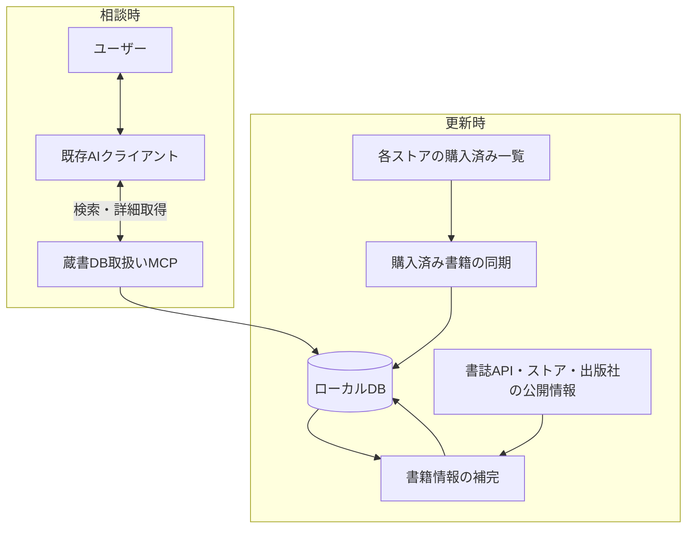

# 設計検討メモ・未決事項

更新日: 2026-09-22

[設計書](01architecture_discussion.md)に載せる前の案・未決事項・検証計画を管理する。ツールやサービスの比較評価は[調査記録](02product_evaluation.md)に記載する。

以下は旧doc/01から保存した検討内容。決定済みの前提を含むが、推奨案やツール候補の名前・引数・データ構造は採用確定ではない。現在の決定事項は設計書を正とし、決定した内容だけを設計書に反映する。

## 1. アーキテクチャ

責務を次の3つに分け、同じローカルDBを利用する。推薦文の生成とユーザーとの対話は既存AIクライアントが担当する。

| 構成要素 | 責務 | 入出力 |
|---|---|---|
| 購入済み書籍の同期 | 各ストアから所有書籍を取得・更新する | 購入済み一覧 → DBの書籍・所有情報 |
| 書籍情報の補完 | 紹介文・あらすじ・カテゴリ・公開目次などを収集する | DBの書籍情報と書誌API・公開ページ → DBの補足情報・出典 |
| 蔵書DB取扱いMCP | AIに蔵書の検索・詳細取得などを提供する | AIからの検索条件 → 所有書籍と関連情報 |

3つを別アプリや別リポジトリにする必要はない。1つのプロジェクト内で処理を分離し、書籍データの型・DB操作・設定・ログ処理を共有する方針を推奨する。

### 購入済み書籍の同期

- 「自分が何を持っているか」を確定する。公開の商品一覧だけでは所有状況を判断できない。
- ストア別に取得処理を分離し、画面変更や認証方式の違いを局所的に扱えるようにする。
- 商品ID、書名、著者、商品URLなど、取得できる情報を保存する。
- 購入済み一覧APIが利用できない場合は、ログイン済みブラウザを用いたスクレイピングを想定する。
- 今回の調査では、4ストアそれぞれで利用できる購入済み一覧APIは確認できていない。「APIが存在しない」と確定したわけではなく、取得方式は実地検証が必要。

### 書籍情報の補完

- 購入済み一覧だけでは不足する推薦材料を、書誌API・公開の商品ページ・出版社ページなどから補う。
- 書誌APIを優先し、不足分を商品ページ・出版社ページから補完する案を検討する。Webページを取得する場合は購入した商品のページを優先する。情報源間で内容が異なる場合の採用基準は未決定。
- 紹介文などには出典URLと取得日時を保存する。
- 情報補完に失敗しても、書籍の所有情報は保持する。
- 商品IDやISBNなどを照合に利用し、別の巻や改訂版の紹介文を結び付けない。曖昧な照合の確定方法は今後設計する。

### 蔵書DB取扱いMCP

- MCPはAIが蔵書を調べるための接続口であり、それ自体が推薦文を生成するわけではない。
- 初期版は読み取り専用とし、同期・収集は別コマンドで手動実行する案を推奨する。
- AIへの質問のたびに全ストアをスクレイピングせず、保存済みデータを検索する。
- ローカルMCPサーバーをAIクライアントから起動する構成を想定する。利用クライアントと接続設定は未決定。

公開するツールの候補は以下。名前や引数は確定したAPI仕様ではない。

| ツール候補 | 機能 |
|---|---|
| `search_books` | キーワード・著者・カテゴリなどで所有書籍を検索する |
| `get_book` | 書籍の紹介文、出典、所有ストア、商品URLなどを取得する |
| `get_library_summary` | 蔵書数、カテゴリの分布、情報補完の状況などを確認する |

## 2. 検索と推薦の考え方

初期版では、既存AIがユーザーの要望を検索語に言い換え、MCPで候補を取得し、紹介文を比較して推薦理由を生成する。必要なら検索語を変えて再検索する。

推薦結果には書名・推薦理由・所有ストアを含める想定とする。紹介文から判断できない内容は断定しない。

### ローカル機械学習モデルは必須ではない

埋め込みモデルは、質問と紹介文を数値ベクトルに変換し、表現が異なっていても意味の近い候補を検索するための追加手段である。本文の取得や要約を目的としない。

たとえば「気持ちが軽くなる本」と「心温まる交流を描いた物語」のように、単語が一致しない場合の検索改善に利用できる。

- 最初から導入する必要はない。実際の質問でキーワード検索の取りこぼしを評価してから判断する。
- 導入する場合も、既存の学習済みモデルを利用し、蔵書で独自モデルを訓練する必要はない。
- ローカル実行と外部APIの選択は導入時に検討する。
- 数百〜数千冊の初期構成では、独立したベクトルDBサーバーを前提にしない。

## 3. データ・運用上の設計候補

以下は推奨案であり、細部は未確定。

| 論点 | 推奨案 |
|---|---|
| 書籍と所有情報 | 書籍情報と、ストアごとの商品ID・所有情報を分ける |
| 重複・版違い | ストアの商品IDを基準に保持し、ストア間の統合は確実なものに限定。巻違い・改訂版は安易に統合しない |
| 所有の範囲 | 無料取得を含む所有書籍を対象とし、読み放題・サンプルは区別する |
| ログイン | 専用ブラウザ環境でユーザーが初回ログイン・追加認証を行い、セッションを再利用する |
| 同期 | 手動で追加・更新する。途中失敗や一時的な非表示を理由に既存の本を自動削除しない |
| 取得失敗 | 所有情報の取得と紹介文の補完の失敗を分け、再実行できるようにする |
| 取得が困難な場合 | 手動CSV取り込みも共通の登録処理につなげられる設計を検討する。ただし初回リリースまではこの件は検討しない。優先度低 |
| 認証情報 | セッションなどの認証情報はMCP出力・通常ログ・リポジトリに含めない |
| AIへの情報提供 | DBがローカルでも、MCPが返す書名や紹介文は利用するAIクライアントに渡る |
| 外部テキスト | 収集した紹介文は書籍データとして扱い、AIへの命令として扱わない |

保存する情報の候補は、書名・著者・巻・版、所有ストア・商品ID・商品URL、紹介文・カテゴリ・公開目次、出典・取得日時・同期結果。具体的なテーブルや必須項目は今後設計する。

## 4. 次に決めること・検証すること

優先して確認する事項:

1. 初回対象のKindleについて、対象のAmazon地域と取得方法を確認する。O'Reillyなど他ストアの詳細確認は各ストアの対応時に行う。
2. 利用するMCP対応AIクライアントと、ローカルサーバーの接続方法。
3. 推薦品質を確認する代表的な質問例と、期待する候補。

最初のストアでの技術検証:

- 利用条件・アクセス制限を確認し、実際のアカウントで取得方式を検証する。
- 購入済み一覧のページ送りなどを含め、全件を取得できるか。
- 安定した商品IDと、紹介文の補完に使えるURLなどを取得できるか。
- 所有書籍・読み放題・サンプルなどを区別できるか。
- ログイン切れや途中失敗を検出し、再実行できるか。

開発の進め方として、まず **1ストアの取得 → 紹介文の補完 → SQLite保存 → MCP検索 → 既存AIによる推薦** までを通す案を推奨する。その後、他ストアへの拡張と検索品質の改善を進める。

評価用の質問例:

- 「持っている本で、SQLの基礎を学べるもの」
- 「重すぎず、気軽に読めるSF」
- 「この作品に近い雰囲気の小説」

加えて、再同期で重複しないこと、途中失敗で既存データが失われないこと、別巻・別版の情報を誤って結び付けないことを検証する。

## 5. 別システムとなるゲーム版への設計・基盤の再利用

検討日: 2026-09-22。ユーザーの補足により、ゲーム版は別システム・別DBとする意図を確認した。同一アプリ・同一DBへの統合を選択肢とした以前の記述を訂正する。共有パッケージの具体的な範囲は未決定。

### 再利用するアーキテクチャ

書籍版・ゲーム版とも「所有情報の同期」「説明情報の補完」「検索機能を提供するMCP」という3つの責務に分ける。それぞれ独立したDB、データモデル、MCPツールを持ち、推薦は利用先のAIアプリが担当する。同じ枠組みを採用するために、共通のコンテンツ型やDBスキーマを作る必要はない。

### 基盤コードを再利用できる候補

| 領域 | 共通化の候補 | 各システムで実装するもの |
|---|---|---|
| 通信・ブラウザ | HTTP処理、アクセス間隔制御、再試行、ブラウザ起動・セッション保存の仕組み | API仕様、ログイン手順、画面解析、再試行条件などのサービス固有設定 |
| 同期 | 実行状況・失敗の記録、再開を支援する仕組み | 取得するデータ、更新・削除の判定、保存処理 |
| DB | 接続管理、トランザクションやマイグレーションを実行する仕組み | DBファイル、テーブル、マイグレーションSQL、クエリ |
| 情報補完 | 出典・取得日時の記録、キャッシュの仕組み | 書籍・ゲームの照合方法、補完項目、情報源別の利用・更新条件 |
| MCP・CLI | 起動、設定、ログ、共通のエラー処理 | ツール名、引数・返却型、検索条件、表示内容 |
| 開発・配布 | テスト構成、ビルド・配布手順、初期設定のひな形 | 製品固有の設定と依存関係 |

共通にするのは仕組みやコードであり、認証セッション・設定・所有データなどの実データを共有する前提にはしない。

### 今の実装で意識すること

- Kindle固有の取得処理、書誌照合、蔵書検索を、通信・DB接続・ログなどの基盤処理から分離する。基盤側から書籍固有の型やルールを参照しない依存関係にする。
- APIとブラウザ操作を取得処理の内部に隠し、同期の基盤にブラウザ操作を必須とする設計を避ける。
- 書籍版の型・テーブル・MCPツールは書籍に適した形で設計する。ISBN・著者などを持つ書籍型や `search_books` という名前を無理に汎用化しない。
- まず同一プロジェクト内のモジュール分離で始める。ゲーム版を作る段階で実際に一致する処理を共有パッケージへ抽出するか、設計・プロジェクトのひな形として再利用するか判断する。
- 初期版から公開プラグインSDK、汎用メディア管理フレームワーク、ゲーム用データモデルは実装しない。

ゲーム版の本編・DLC・セット商品、利用権、版違い、プレイ状況などの扱いは、その別システムで設計する。書籍版の初期実装をそれらの決定待ちにしない。
